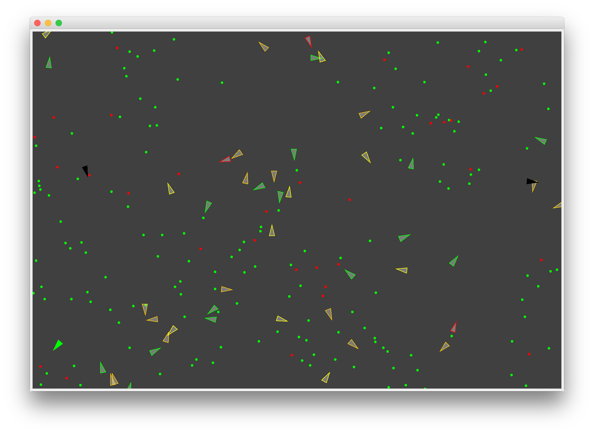

# Evolutionary Steering Simulation

This is an Object Oriented Java version of an evolutionary steering simulation based on a Coding Challenge by Daniel Shiffman (Conding Train).  

Video on Coding Train: https://www.youtube.com/watch?v=flxOkx0yLrY&t=323s (Part 1/5)  
Original Source-Code: https://github.com/CodingTrain/website/tree/master/CodingChallenges/CC_69_steering_evolution  
Coding Train YouTube-Channel: https://www.youtube.com/user/shiffman  

## Screenshots

Screenshot with Debug-Mode turned Off:

Screenshot with Debug-Mode turned On:

## Features

* Press 'd' to toggle Debug-Mode
* Press space-bar to generate a new ant at a random location with random genes
* Left-click: Add new food
* Right-click: Add new poison
* Predators eat poison and ants
* The healthiest ant is highlighted
* Dead ants turn into food
* The color of the ants indicate their Health-level (red - almost dead; green - very healthy)
* Ants 

## Description

This little program is meant to simulate evolution. At the beginnig 30 ants are generated at random locations with a random DNA (consisiting of food perception, poison perception, food attraction, posion attraction). Every ant has a health-level between 0 and 100. Every frame the health of ant is reduced by a certain amaount. Once the health of an ant is 0 the ant dies and turns into food. To increase the health of an ant it has to eat food (green point), if it eats poison (red point) their health gets decreased. Ants can breed new ants. This happens randomly but it's depending on the ants health. The healthier an ant is the likelier it will breed. The "new" ant will have a slightly mutated DNA of his "parent", although every now and then a completely random DNA will be generated. Two predators (black) are trying to eat ants and poison. Ants can't "see" the predators yet, so they are unable to flee (see TODO).  

In debug-mode the DNA of an ant is shown:
* green circle: perception food
* red circle: perception poison
* green stroke: attraction food
* red stroke: attraction poison

## TODO

* Ants can't "see" predators yet: They should be able to see preadtors and flee from them
